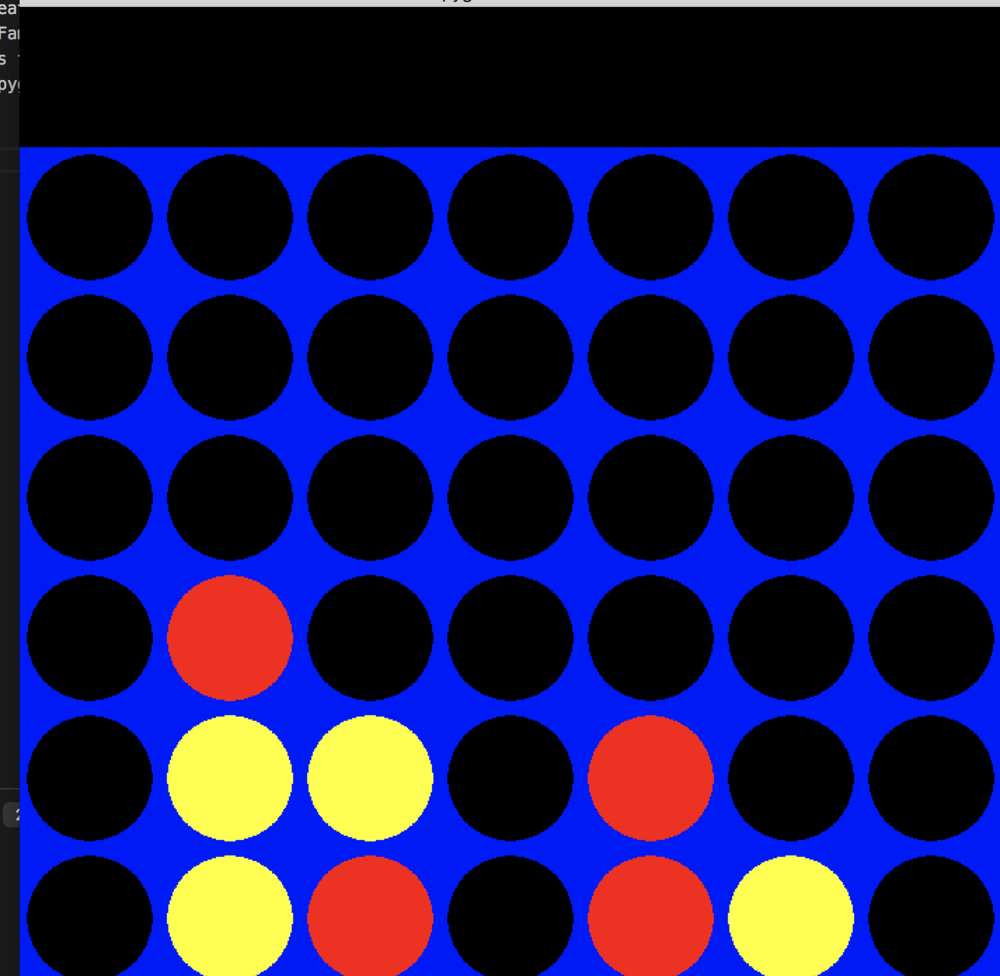

One week python project created a connect 4 game with a graphical user interface. Familiarizing myself with the language itself and the many modules that are in the python library. The GUI was mainly build with pygame. 

To run the game, just run 'python3 connect4.py' in your terminal at the appropriate directory. This will run the 2 player hot seat version.

`Screenshots`

Currently working on developing an algorithm for a computer to play against. Currently it is just randomly placing its spots.

To run a sample of the computer versus version, just run 'python3 aiconnect4.py' in your terminal at the appropriate directory.